# How I Finished OffSec In One Year

In the name of Allah, Most Gracious, Most Merciful. 

Although I've received many requests to create this blog, I'm finally getting around to it. I may be a bit late, as I completed all the Offensive Security (OffSec) certifications in 2023. However, I'm excited to share this post where I discuss how I managed to pass all the OffSec exams within a year!

While I consider this achievement significant, I believe there is still much more for us to accomplish as the Offensive Security community. Often, we tend to overrate obstacles, and after confronting them, we find that the seemingly high barriers were, in fact, much smaller and closer than anticipated. There are always even greater challenges ahead that require us to stay prepared and continually push our limits.

# Table of Contents

0. [Introduction](#introduction)
1. [Background](#background)
2. [Story](#story)
3. [My Approach](#my-approach)
4. [My Methodology](#my-methodology)
5. [Note Taking](#note-taking)
6. [Time Management](#time-management)
7. [Avoiding Frustration](#avoiding-frustration)
8. [Exam Preparation](#exam-preparation)
9. [Reporting](#reporting)
10. [OffSec Wireless Professional (OSWP)](#offsec-wireless-professional-oswp)
11. [OffSec Certified Professional (OSCP)](#offsec-certified-professional-oscp)
12. [OffSec Web Assessor (OSWA)](#offsec-web-assessor-oswa)
12. [OffSec Web Expert (OSWE)](#offsec-web-expert-oswe)
12. [OffSec Experienced Penetration Tester (OSEP)](#offsec-experienced-penetration-tester-osep)
12. [OffSec Exploit Developer (OSED)](#offsec-exploit-developer-osed)
12. [OffSec Certified Expert 3 (OSCE3)](#offsec-certified-expert-3-osce3)
12. [OffSec macOS Researcher (OSMR)](#offsec-macos-researcher-osmr)
13. [Conclusion](#conclusion)

## Introduction

Based on numerous requests, I've created this blog post to share my experience of achieving all the OffSec certifications within a year (10 months). I will discuss my approach, the journey I undertook, and offer advice on overcoming obstacles, dealing with frustration, and preparing for exams. I won’t delve into the specifics of each certificate's content or focus areas, as there are many comprehensive blogs that already cover these aspects thoroughly. Instead, my aim is to provide personal insights and experiences that may offer a unique perspective and be beneficial to others.

CAUTION: This blog post includes some of my personal study methods, problem-solving approaches, and strategies. While these methods may not suit everyone, I hope they can provide valuable insights and assistance to those who may find them helpful.  

## Background

Before delving into my approach and how I achieved this milestone, I want to clarify that I have a solid background in penetration testing. Before attempting the OffSec exams, I completed all Penetration Testing Certifications from eLearnSecurity, such as **eCXD**, **eCPTXv2**, **eWPTXv2**, **eCPPTv2**, **eWPT**, and **eMAPT**. I also obtained certifications from Altered Security (formerly Pentester Academy), including **CRTP** and **CRTE**.

With years of experience in penetration testing and as a cybersecurity trainer, I am well-versed in how to approach a course and understand how instructors design training programs, including the typical focal points. I was already leading a penetration testing team and had experience in nearly all the specializations covered by each exam. Therefore, my study techniques may not be suitable for those who are just starting out. Nonetheless, I will describe my study methodology in as much detail as possible.

## Story

In January 2023, I had just completed my **eCRE** certification from eLearnSecurity. Although I didn't particularly enjoy the course or the exam, it was a fun experience overall. However, I felt bored and wanted to challenge myself with something bigger. I considered pursuing the [Learn Unlimited Package](https://www.offsec.com/products/learn-unlimited/) from OffSec, which provides access to all OffSec exams and content for one year. However, there were two main obstacles:

- The cost was $5,500 USD annually (I Believe it is $5,800 Now) .
- Due to USD limitations in Egypt, it was nearly impossible to acquire USD and transfer it to a company outside the country.

For the first challenge, I reached out to my employer, [Zerosploit MEA](https://www.zerosploit.co/), to sponsor my Learn Unlimited subscription. They generously agreed, which was a significant gift, especially considering the hard work I had put in while working with them, including handling difficult situations and developing key services. It was incredibly rewarding to see my efforts pay off in this way. This support motivated me to push myself even further to prove that I truly deserved this opportunity. I am deeply grateful to [Zerosploit MEA](https://www.zerosploit.co/) for their belief in my capabilities and their support.

The second obstacle was quite different. Egypt was experiencing significant currency restrictions at the time, making it extremely difficult to obtain USD. The Egyptian Pound (EGP) was significantly devalued, and debit cards were restricted from international use due to the currency shortage. Additionally, credit cards were severely limited and generally only issued to travelers with specific restrictions. Consequently, purchasing the Learn Unlimited subscription, which costs $5,500, became nearly impossible.

Starting in February 2023, I was searching for a solution to this issue. By March 2023, I connected with a friend of a friend who lives in Europe and was interested in transferring his savings to Egypt in EGP. This arrangement covered only part of the payment. I also found another friend who could cover the remaining amount, with the understanding that I would reimburse him later. I had to contact OffSec to request permission to make the payment in two separate transfers from different sources, which they found somewhat unusual.

I would like to extend my special thanks to both of my friends for their invaluable assistance in this situation. Their support was crucial and greatly appreciated.

I agreed with OffSec to commence my subscription on March 18, 2023.

## My Approach

Approaching OffSec was not straightforward. Their "Try Harder" methodology reflects how they conduct their training programs, emphasizing a rigorous and challenging approach.

Based on my wife's advice (without whose support I would not have achieved this), I scheduled all the exams with specific dates. Her guidance was instrumental in pushing me to stay on track and avoid wasting time

My plan was to begin with the exams I considered to be the easiest (from my perspective) in below order:

1. OSWP
    - The easiest exam on my list, given my experience with wireless security. Since it was a relatively short exam, I chose to start with it.
2. OSCP
    - Although OSCP is considered an **entry-level certification** (a fact that some still dispute), I placed it second on my list.
3. OSWA
    - Despite being at the same level as OSCP, I scheduled OSWA after OSCP to refresh my web application skills, as I planned to follow it with OSWE. 
4. OSWE
    - I viewed OSWE as the first major challenge. Given my comfort with web penetration testing and source code review, I decided to tackle this significant challenge early on.
5. OSEP
    - I placed OSEP after OSWE to allow ample time for preparation. Although I eventually considered it to be on par with OSWE, this scheduling was deliberate to ensure sufficient focus.
6. OSED
    - Known as the hardest of the OSCE3 chain, I reserved this for last. It indeed proved to be the most challenging, requiring significant practice and time in the lab. Despite its difficulty, I thoroughly enjoyed it. 
7. OSCE3
    - Upon completing the trio of OSWE, OSEP, and OSED, I earned the OSCE3 certification.
8. OSMR 
    - This was the most intriguing certification for me. I aimed to complete all other certifications before tackling OSMR because I lacked experience in macOS security. I anticipated that this certification would be time-consuming but highly educational.

  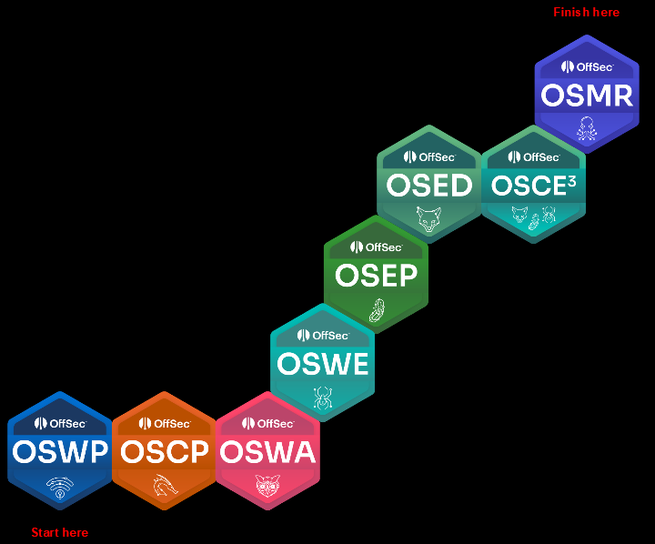

## My Methodology

Since I aimed to complete all OffSec exams before my Learn Unlimited subscription expired, I adopted what I call the **Rapid Precision Method**. This approach involved swiftly tackling all the lab challenges and materials to assess my ability to handle them. If I encountered difficulties, I would revisit the study materials and refresh my knowledge, given the time constraints. While this method worked for me, I would not recommend it for beginners, as it can be quite frustrating. 

For those new to the material, sticking to the OSMR methodology is advisable, as it offers a more structured approach. Since MacOS Security was new to me, I approached it with a different strategy tailored to my experience level.

Below is a graph summarizing the **Rapid Precision Method (RPM)**:

  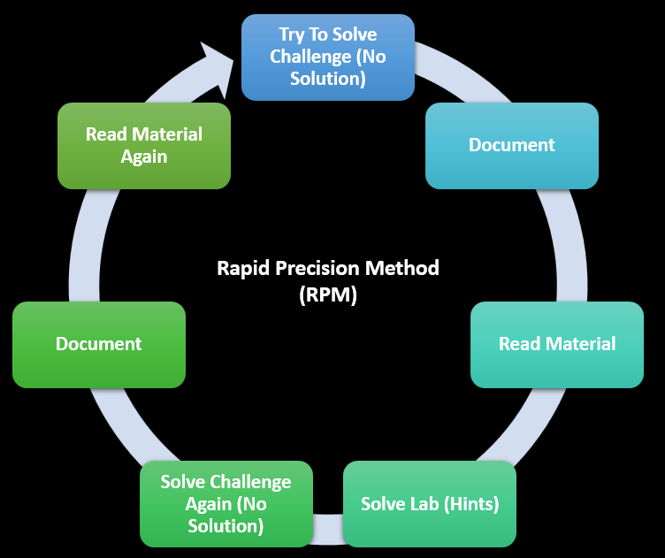

Also, don't forget to join the OffSec Discord community, as it offers a great space for networking, support, and sharing knowledge with others pursuing similar goals.

## Note Taking

For note-taking, I used [Obsidian](https://obsidian.md/), which I was comfortable with. With three horizontal screens and one vertical screen, utilizing the vertical screen for note-taking with Obsidian proved to be extremely effective and efficient.

### Notes Structure:

- **Chapter X**
    - **Intro**
    - **Section X**
        - Section Details 
    - **etc..**
    - **Summary**
        - Here, I write a summary of the chapter, including what I learned and the outcomes achieved.
    - **Helpers** 
        - Here, I organized all code snippets, one-liners, and scripts that I might use quickly, even during exams.
- **Challenge X**
    - **Task**
        - What is the Task ? How To Solve ? Why ?
    - **General Information**
        - General Information regarding the task, Scope, Snippets, Approach etc..  
    - **Indicators Of Vulnerability**
        - What are the indicators that led to the discovery of the vulnerability?
    - **Exploitation**
        - How did I exploit the vulnerability? What was the difficulty level, and what challenges did I encounter?
    - **Privilege Escalation (Depends on The Content)**
        - How did I perform the privilege escalation? What was the difficulty level, and what challenges did I face?
    - **Lateral Movement (Depends on The Content)**
        - How did I execute lateral movement? What was the difficulty level, and what challenges did I encounter?
    - **Summary**
        - Here, I write a summary of the chapter, including what I learned and the outcomes achieved.
    - **Helpers** 
        - Here, I organized all code snippets, one-liners, and scripts that I might use quickly, even during exams.
    - **Special Techniques**
        - What special techniques did I use, how did I implement them, and why did I decide to use them?  

I use [Lightshot](https://app.prntscr.com/en/index.html) for taking screenshots because it's very fast and allows me to capture specific areas of the screen. It also enables me to add arrows and make edits on the go. Additionally, Lightshot lets me copy and paste screenshots directly into Obsidian, significantly speeding up the documentation process.

The reason I start with challenges without solutions is that the human mind tends to take the path of least resistance, often searching for existing solutions rather than finding them independently (which can be beneficial at times). By starting with challenges that have no available solutions—meaning truly no solutions provided—I eliminate the option for my mind to seek out an answer file. If the mind knows a solution exists, it will subconsciously focus on finding it instead of solving the problem. Tackling challenges without solutions forces me to push my mind to its limits, exploring the boundaries of my problem-solving abilities and seeing how far I can go.

## Time Management

Since I have a full-time job leading a penetration testing team and conduct side trainings online, my schedule is always busy day and night. Due to my limited time, I often study from 9 PM to 4 AM. When I have training sessions, which usually end around 11 PM, I start studying at 11:30 PM and continue until 4 or 5 AM. This allows me to get a few hours of sleep before waking up around 9 or 10 AM for work.

After OSWE, my time got more squeezed since we got our baby daughter Alhamdullah and I had to trim some of my time staying with the family. At the same time, Egypt Started applying Electricity outages at a minimum of 1 Hr and can extend to 3 Hrs daily which wastes time and causes frustration.

On weekends, I usually dedicate the entire day to studying, except when I'm visiting family or have a scheduled exam.

## Avoiding Frustration

During this challenging journey, I faced many obstacles and often felt frustrated. From the initial difficulties of purchasing the subscription to the ongoing challenges of daily electricity outages in Egypt, which lasted a minimum of 1 hour and could extend up to 3 hours, the path was far from smooth. These outages occurred even during my exams, leading me to lose 2 to 3 hours of exam time due to power cuts. I had to inform the proctor to pause the exam whenever I got disconnected, ensuring that the exam wouldn't be affected by these interruptions.

The journey itself was neither easy nor exceptionally hard. I believe the key to avoiding frustration is to remain dedicated, accept failure, and continuously remind yourself: "If it were easy, anyone could have done it."

If you encounter a topic you don't understand and find yourself struggling despite repeated attempts, take a step back and try to approach it from a different angle. Use whiteboards, papers, notes, and graphs to trick your brain into grasping the concept. Sometimes changing your method of study can provide new insights and facilitate understanding.

Over time, as you persist through difficult problems, you may experience a phase I call **Thinking Supremacy**. In this state, your mind starts to independently tackle issues and provide unexpected solutions. You’ll notice this when your brain offers insights or solutions that you hadn’t consciously considered. Embrace these ideas, test them thoroughly, and see if they lead to the resolution of your problem or if they need further adjustment.

As a Muslim, I believe that praying and asking Allah for guidance and strength plays a crucial role in overcoming challenges. Returning to Allah in prayer significantly reduces frustration and helps me accept my circumstances, while still motivating me to continue working diligently.

## Exam Preparation

I find that a single statement is often enough to prepare you for the exam: **"Solve The Challenges."**

Since I scheduled all my exams at the start of the subscription, I made an effort to stay on track. I booked my exams during vacations to minimize distractions and avoid potential work-related issues. For example, I scheduled most of my exams on weekends and during Eid vacations to ensure I could focus fully on the exams.

Of course, each exam has its own specific rules, which I will detail separately. However, here are some general tips and tricks:

- **Sleep Well**: Aim for a minimum of 6 to a maximum of 8 hours of sleep before the exam.

- **Schedule Wisely**: Choose exam times that align with your usual waking hours. For instance, since I am often awake at night, I typically schedule exams to start around 11 PM.

- **Stay Hydrated**: Drink plenty of water to maintain focus and energy.

- **Coffee**: If you consume coffee, have a cup to stay alert.

- **Distractions**: OffSec requires all electronic devices, such as cell phones, to be outside the room this will help you to avoid distractions.

- **Take Regular Breaks**: Schedule breaks to avoid burnout and maintain concentration.

- **Eat and Drink**: Ensure you eat and drink enough to stay focused throughout the exam.

- **Camera**: You will be monitored by a proctor via camera, which might feel uncomfortable initially, but you will get used to it.

- **High-Quality Camera**: Use a high-quality camera for proctor verification, as you will need to show your room and ID clearly.

- **Fast Internet Connection**: Ensure a stable and fast internet connection, as streaming multiple screens and your camera can consume significant bandwidth and resources.

- **Read Exam Rules**: Carefully review each exam's rules to avoid violating them. The rules are set for a reason.

- **Document During the Exam**: Take screenshots and document your steps throughout the exam to reduce reporting time and prevent losing important screenshots.

- **During Fasting**: During Ramadan, schedule exams to start after Iftar by 4 Hrs to ensure you are well-hydrated and focused.

- **Finishing Early**: If you complete the exam ahead of time, inform the proctor and close the session early to begin your reporting and save time.

- **Remote Desktop Software**: Remove any remote desktop software, such as AnyDesk or TeamViewer, before the exam. The proctor will ask you to remove these applications, and they can detect their presence even if you think otherwise.

- **Document Your Thoughts**: Carefully document your thoughts, steps, discoveries, exploitation processes, and proofs. This will not only help you during the exam but also ensure that your report is thorough and clear.

- **Escape From The Matrix**: Convince yourself that the exam is a challenge with a definitive solution. Picture yourself as Neo in The Matrix, believing that the Matrix is not real and that you possess the power to control your reality. Harness this mindset to bend the exam to your will, rather than letting it overwhelm you.

## Reporting

Using your notes, create a report based on the template provided by OffSec. The OffSec Template for each exam, which is shared on the Reporting Requirements page, is usually sufficient. However, I have made some modifications to include more detailed descriptions and graphs. Here is an example of a [report-template](https://www.offsec.com/pwk-online/OSCP-Exam-Report.docx) from OffSec for the OSCP exam.

The report should at least include, but is not limited to, the following sections:

- Introduction
- Objective
- Requirements
- High-Level Summary
- Recommendations
- Vulnerabilities
- Methodologies
- Enumeration
- Target 1
    - Vulnerabilities
    - Exploitation
    - Proof of Concept
    - Privilege Escalation
    - Lateral Movement
- Target 2
    - Vulnerabilities
    - Exploitation
    - Proof of Concept
    - Privilege Escalation
    - Lateral Movement
- Conclusion

These are the essential sections, though you can expand upon them as needed. In real-world scenarios, reports often include additional details beyond these basic headings. 

## OffSec Wireless Professional (OSWP)

  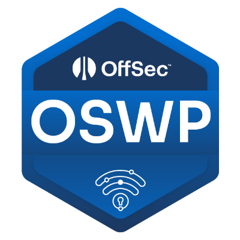

I didn’t study the content extensively because I already had prior experience in this area. Instead, I booked the exam and decided to take it based on my existing knowledge.

* [Exam Guide](https://help.offsec.com/hc/en-us/articles/360046904731-OSWP-Exam-Guide)
* [Exam FAQ](https://help.offsec.com/hc/en-us/articles/360046904551-OSWP-Exam-FAQ)

Starting with the easiest exam, I booked the OSWP exam on the same day I activated my subscription, which was March 18, 2023. I scheduled the exam around 2 AM. At that time, I was traveling and only arrived home at 11 PM, so I had just a few hours of sleep before the exam. Despite the lack of rest, I pushed myself to the limit. The exam lasted approximately 3 hours and 45 minutes and involved attacking three wireless networks. To pass, I needed to solve at least two of the networks and obtain the *proof.txt* file.

During the exam, I encountered issues with screen sharing with the proctor and several other technical problems that consumed a whole hour of my exam time. Despite these challenges and the already limited time, I managed to successfully exploit two networks, take screenshots, and still had one hour remaining.

The exam is not particularly difficult, and reviewing the content thoroughly should be sufficient to pass.

The course recently received an update, but I believe it is still somewhat outdated and lacks coverage of certain topics. For instance, despite the certificate being named **"OffSec Wireless Professional,"** it focuses exclusively on Wi-Fi and overlooks other areas such as Radio, Narrowband, and the use of SDRs. While these topics are more advanced and pertain to IoT and hardware, the term "wireless" is broadly defined and encompasses technologies beyond just Wi-Fi.

After submitting the report and resting for a few hours, I received the exam results email on March 19, 2023.

In conclusion, the OSWP course is average, while the exam itself is well-designed.

## OffSec Certified Professional (OSCP)

  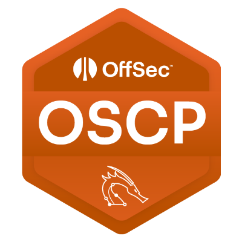

I won't go into detail about the content of the OSCP or its focus areas, as there are many excellent blogs that have already covered this topic thoroughly. Instead, I'll focus on sharing my personal experience and insights, which may offer a unique perspective and be helpful to others.

I didn't have much time to go through the content and I didn't need to thus I focused on solving the challenges and taking notes:

* [Exam Guide](https://help.offsec.com/hc/en-us/articles/360040165632-OSCP-Exam-Guide)
* [Exam FAQ](https://help.offsec.com/hc/en-us/articles/4412170923924-OSCP-Exam-FAQ)

I scheduled the OSCP exam for April 8, 2023, which gave me ample time to complete the challenges and take detailed notes before attempting the exam

During Ramadan, I planned to take the OSCP exam during the night, from 9 PM to 3 AM, as I would be fasting in the morning and might not be fully focused. However, this plan proved unnecessary, as fasting did not hinder my ability to focus during the exam or my studies; in fact, it had the opposite effect.

I started the OSCP exam around 10 PM and successfully completed it by around 3:30 AM, achieving 100% of the points within approximately 5.5 hours. This was a satisfactory completion time for an exam that, as mentioned earlier, is considered Entry-Level.

Here are my tips and tricks for studying for the OSCP, especially for entry-level candidates:

- Ensure you go through all the provided materials.
- Engage deeply with the lab exercises to build practical skills.
- Document your findings , techniques, and processes meticulously.

For the exam itself, working through the challenges will provide a clear understanding of what to expect, aligning with OffSec’s guidance in their Exam Guide. It's crucial to take detailed notes during the exam. For example, when you identify a vulnerability that you believe is the correct path, start documenting it immediately. This approach helps ensure thoroughness and accuracy in your final report.

The reporting process was straightforward. I had already documented each scenario and captured screenshots during the exam, including the proof of concept (PoC). I ensured that the screenshots clearly displayed the **proof.txt** and **local.txt** files, which are essential for verifying successful exploitation.

My final advice for the **OSCP** is to practice thoroughly before the exam. If you're experienced, try not to overthink the process. Trust in your preparation and skills, and approach the exam with confidence.

I submitted my report on April 9, 2023, and received the results on April 13, 2023.

While comparisons between **OSCP** and **CRTP** or **CRTO** are common, they may not always capture the full scope of each certification. The **OSCP** covers a broader range of topics and areas compared to **CRTP** or **CRTO**, which focus specifically on Active Directory. My advice would be to complete the OSCP first to gain a comprehensive understanding of penetration testing. Following up with **CRTE** or **CRTO** would then provide a specialized focus on Active Directory and more advanced techniques. This combination will equip you with a robust skill set, positioning you as a infrastructure penetration tester.

In conclusion, **OSCP** is still an entry-level certification, and I highly recommend it to anyone who wants to start in the penetration testing field. However, I always advise you not to stop there, as there are many more topics to learn before specializing in a specific area.

## OffSec Web Assessor (OSWA)

  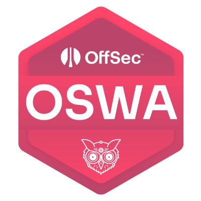

Same as **OSCP**, I didn't have much time to go through the content and I didn't need to thus I focused on solving the challenges and taking notes

From the challenges, I found that **OSWA** emphasizes a black-box approach and aims to develop web penetration testers who are adept at identifying bugs within a limited timeframe. 

* [Exam Guide](https://help.offsec.com/hc/en-us/articles/4410105650964-WEB-200-Foundational-Web-Application-Assessments-with-Kali-Linux-OSWA-Exam-Guide)
* [Exam FAQ](https://help.offsec.com/hc/en-us/articles/4410194351252-WEB-200-Foundational-Web-Application-Assessments-with-Kali-Linux-OSWA-FAQ)

I scheduled my exam for the evening, starting around 8 PM on 26 May 2023. After approximately 8 hours, I completed 100% of the exam. I then slept for a few hours before waking up to begin the reporting process.

The exam itself was relatively straightforward and, in fact, quite easy. If you are an experienced web penetration tester, avoid overthinking the challenges. For beginners, focus on attention to detail and practice fuzzing and discovery techniques.

I submitted my report on May 27, 2023, and received the results on May 29, 2023.

If I compare **OSWA** to **eWPTXv2**, they are quite similar, though I would recommend OSWA slightly more. The approach in OSWA is particularly interesting, and the exam itself is both engaging and more challenging compared to the eWPTXv2 exam. Additionally, OSWA benefits from OffSec’s proctoring, which adds an extra layer of credibility and integrity to the exam process.

In conclusion, like the **OSCP**, the **OSWA** is an entry-level certification, and I highly recommend it for anyone starting in the web penetration testing field. However, I advise not stopping there, as there are many web vulnerabilities and scenarios not covered by the OSWA. Continued learning and exploration beyond this certification are essential for a comprehensive understanding of web security.

## OffSec Web Expert (OSWE)

  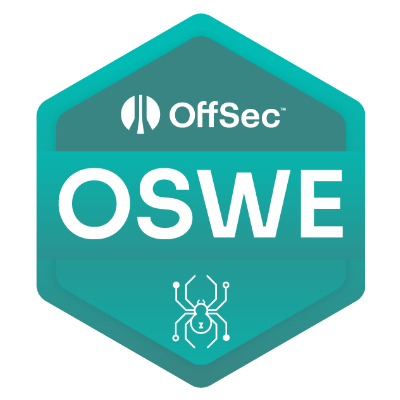

Starting from here, I can say that the real challenges began, as OSWE is classified by OffSec as a Level 3 course. Expect it to be significantly more difficult than OSWA. While both OSWA and OSWE focus on web security, OSWE takes a White-Box approach, which sets it apart and adds a layer of complexity.

* [Exam Guide](https://help.offsec.com/hc/en-us/articles/360046869951-WEB-300-Advanced-Web-Attacks-and-Exploitation-OSWE-Exam-Guide)
* [Exam FAQ](https://help.offsec.com/hc/en-us/articles/360046418812-OSWE-Exam-FAQ)

I loved the content of the OSWE course. I approached the material using the RPM methodology, but found that I needed to revisit some topics and thoroughly work through the labs, not just the challenge labs. I’m glad I did this because the material and labs are exceptional, delving into every detail. It's as if every question of "What," "How," and "Why" is answered in a single response. I really appreciated how the course emphasizes research over the traditional "find and report" approach to penetration testing.

I scheduled my exam for 7 June 2023. After approximately 24 hours, I completed the exam. Adding 6-8 more hours for automation, I finished and documented everything along with my PoC. I then slept for a few hours before waking up to begin the reporting process, although I ended up not needing a full reporting day.

I would describe the exam as challenging but rewarding. It’s neither too easy nor too hard, striking a balance that makes it a worthwhile experience.

My advice for preparing for the OSWE is as follows:

- **Solve the Labs**: Work through all the labs thoroughly to understand the material and practice your skills.

- **Complete the Challenges**: Ensure you solve all the challenge labs to build confidence and competence.

- **Tackle Extra Miles**: Engage with additional exercises and "extra miles" provided to deepen your understanding.

- **Practice with Open Source Products**: Gain hands-on experience by working with open source software to broaden your exposure.

- **Automate Solutions**: Practice writing scripts to automate the solving of challenges. For instance, select a machine or web challenge and develop a script to address it automatically.

- **Pay Attention to Details**: Be meticulous in your approach, noting every detail as it can be crucial for uncovering vulnerabilities.

- **Approach Rabbit Holes Differently**: Instead of searching directly for vulnerabilities, consider how the application could be vulnerable based on its design and functionality. This approach, honed through ample practice, will help you navigate and resolve complex issues.

I submitted my report on June 9, 2023, and received the results on May 11, 2023.

I believe that there is no other certification or exam that can be directly compared to the OSWE. In my experience, it stands out as a unique and exceptional certification in its field.

In conclusion, the OSWE course is highly valuable and is neither over-rated nor under-rated. If you are interested in delving into security research beyond traditional web penetration testing, I highly recommend undertaking this course. It is also ideal for those looking to enhance their skills in security source code review.

## OffSec Experienced Penetration Tester (OSEP)

  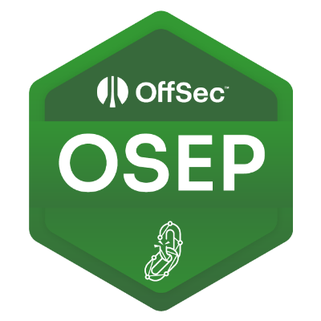

OSEP is classified by OffSec as a Level 3 course, indicating a significant increase in difficulty compared to OSCP. While both certifications focus on infrastructure penetration testing, OSEP introduces advanced elements such as sophisticated Active Directory attacks, evasion techniques, and methods to bypass security controls like antivirus and EDRs. The course provides foundational knowledge that you will build upon to develop skills in red teaming and circumventing complex security products.

Although OSEP is not specifically a red teaming course, it teaches essential fundamentals that are crucial for building the skills necessary to become a red team operator.

* [Exam Guide](https://help.offsec.com/hc/en-us/articles/360050293792-OSEP-Exam-Guide)
* [Exam FAQ](https://help.offsec.com/hc/en-us/articles/360049781352-OSEP-Exam-FAQ)

I thoroughly enjoyed the OSEP content and found it to be exceptionally comprehensive and well-crafted. The course material is extensive and thoughtfully designed. I highly recommend that you go through every part of the course without skipping any sections, as it provides valuable knowledge and insights that are essential for mastering the subject.

I scheduled my OSEP exam for July 21, 2023. After approximately 24 hours of intense work, I completed the exam and then spent additional time documenting everything thoroughly. Following this, I took a few hours of rest before beginning the reporting process. It’s worth noting that the reporting phase can be quite challenging, as you will need to document every detail, scenario, and approach, along with each flag you discovered. This extensive documentation process can be overwhelming, but it’s a crucial part of delivering a comprehensive and well-organized report.

I would describe the OSEP exam as both challenging and extensive. It thoroughly tests your knowledge across every aspect you have studied. While it is demanding, you will truly appreciate the depth and breadth of the content covered, as it rigorously evaluates your understanding and skills.

My advice for preparing for the OSEP is as follows:

- **Thoroughly Complete the Labs**: Engage deeply with all lab exercises to master the material and enhance your practical skills.

- **Address All Challenges**: Ensure that you solve all challenge labs to build both confidence and expertise in your abilities.

- **Comprehensive Documentation**: Keep detailed records of every aspect of the course and the labs you have completed to aid in review and reporting.

- **Develop Custom Payloads**: Create and refine your own payloads that integrate multiple techniques for evading antivirus software.

- **Maintain a One-Liners Document**: Compile a document with useful one-liners and commands to streamline your process during the exam.

- **Organize Documentation for Accessibility**: Structure your documentation to ensure it is easily accessible and organized during the exam.

- **Avoid Skipping Any Content**: Do not skip any part of the course. Each section contributes to the overall understanding required for success.

I submitted my report on July 23, 2023, and received the results on Aug 3, 2023.

It is not entirely accurate to compare OSEP to CRTL directly, as they serve different purposes and cover distinct areas within the field of cybersecurity. Comparing OSEP to CRTL is akin to comparing a high-performance car to an exceptionally high-performance engine. Each excels in different aspects: CRTL is well-regarded for its extensive focus on EDR evasion techniques and C2 infrastructure, while OSEP provides a broader and more professional approach to penetration testing.

From my experience, OSEP offers a more comprehensive and practical preparation for real-world scenarios, covering a wider range of advanced topics compared to CRTL. However, CRTL excels in specific areas such as evasion and C2 infrastructure, which are valuable in their own right.

Therefore, if you aim to become a well-rounded red teamer, pursuing both OSEP and CRTL will provide you with a complete skill set. Combining the strengths of both certifications will enhance your expertise in evasion techniques and red teaming strategies.

In conclusion, the OSEP course is exceptionally well-crafted and comprehensive. It offers a deep and rewarding learning experience, and while the exam presents significant challenges, it is also highly enjoyable. The reporting process can be demanding, but with the right preparation, you can handle it effectively. I highly recommend OSEP to anyone who has completed the OSCP or those seeking hands-on experience with Active Directory and advanced evasion techniques.

## OffSec Exploit Developer (OSED)

  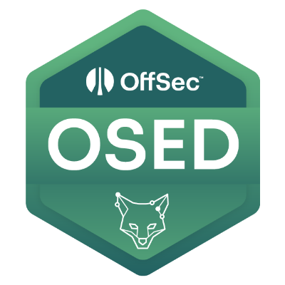

OSED is classified by OffSec as a Level 3 course, similar to OSEP and OSWE. However, from my perspective, it was significantly more challenging. Despite my prior experience in exploit development and reverse engineering—covering not only x86 but also x64 and Kernel Mode—the exam proved to be the most difficult among all the exams I have attempted.

Although OSED focuses on x86 Windows User Mode Exploit Development, which might initially seem straightforward, it turned out to be quite the opposite. The content of the course is extremely well-crafted, but it is the challenges that truly elevate the course. In my experience, the journey and difficulty of the challenges are what make this course exceptional, rather than the content alone.

* [Exam Guide](https://help.offsec.com/hc/en-us/articles/360052977212-EXP-301-Windows-User-Mode-Exploit-Development-OSED-Exam-Guide)
* [Exam FAQ](https://help.offsec.com/hc/en-us/articles/360053660531-OSED-Exam-FAQ)

I enjoyed the content, finding it exceptionally well-crafted, and the challenges were extremely valuable, particularly the Extra Miles. You will encounter some tough Extra Miles during your study, and the lab challenges at the end are notably challenging. These aspects make the course both engaging and demanding, offering a thorough and rewarding experience.

I scheduled my OSED exam for November 9, 2023. After approximately 30 hours of extremely intense work, I completed what was sufficient to pass the exam. The exam was incredibly challenging, and the reporting process was a nightmare. Throughout the exam, you might find yourself questioning whether you really need to go through all this effort just to pass. Despite the difficulties, I admired this exam because it pushed me to my limits and provided the challenge I truly loved.

My advice for preparing for the OSED is as follows:

- **Thoroughly Complete the Labs**: Engage deeply with all lab exercises to master the material and enhance your practical skills.

- **Address All Challenges**: Ensure that you solve all challenge labs to build both confidence and expertise in your abilities.

- **Tackle Extra Miles**: Engage with additional exercises and "extra miles" provided to deepen your understanding.

- **Proficiency in Assembly**: Develop a strong comfort level with reading and writing assembly code.

- **Consistent Practice**: Regularly practice and train yourself, addressing each challenge using multiple approaches.

- **Prepare Your Skeletons**: Understand the importance of skeletons and how to utilize them effectively.

- **Invest in Reverse Engineering**: Enhance your reverse engineering skills through continual practice.

- **Comfort with Assembly and Exploitation**: Ensure you are very comfortable with reading, writing, and understanding assembly code, as well as bypassing controls and understanding how vulnerabilities exist and can be exploited.

I submitted my report on Nov 12, 2023, and received the results on Nov 14, 2023.

There is no ceritifcation i know i can compare to OSED and i think it is uniqe espcially the exam

Don’t expect to pass without significant effort; you’ll need to be nearly perfect in each topic of the syllabus, including shellcoding, buffer overflows, ROP chains, and more. The course demands a high level of proficiency and dedication. It felt as though there was someone there, setting obstacles in your path—like fighting thousands of agents in the Matrix as you are the choosen one. Imagine the agents as the problems you face; if you train hard and smart enough, you might become like Neo, able to overcome these challenges.

Some people say that the course is somewhat outdated, and I agree to an extent since it focuses only on x86 and Windows. However, in this context, it’s not about what is current or outdated. Instead, it's about depth versus breadth. You can teach someone to add a screw to build something, or you can teach someone how the screw was built, why it must fight shear force, etc. OSED is well-detailed and challenging. It aims to push students to their limits, encouraging them to understand the details thoroughly and master the subjects, not just execute tools or perform attacks.

There are no huge differences between x86 and x64 anyway. Since I had experience in x64 before, I can say that the key to understanding and exploiting vulnerabilities in x64 is to have a solid grasp of x86. It's similar to understanding how processors are built: knowing how the first processor was built makes it easier to comprehend more advanced ones.

In conclusion, the OSED course was great despite the challenges, dead ends, and sleepless nights. It is extremely rewarding. If I had the choice to do it again, despite all the suffering, I would—and I would do it multiple times.

## OffSec Certified Expert 3 (OSCE3)

  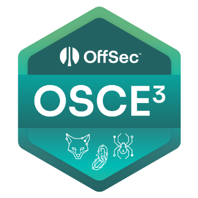

Of course, I will not elaborate much on OSCE3 since it is not a standalone course or exam. You achieve OSCE3 by completing OSWE, OSEP, and OSED. However, I will share my thoughts on it.

The OSCE3 journey was very fulfilling. I can say that I didn't suffer much to achieve it overall, as I completed it in about 4-5 months, which wasn't too long. Nonetheless, I greatly respected this journey.

It is worth mentioning that I was the first person in Egypt to achieve OSCE3 and i think the first one globally to achieve it in such a short timeframe. This accomplishment greatly encouraged me to continue pursuing my goals.

In conclusion, OSCE3 is a highly recognized certificate that demonstrates a diverse skill set. It serves as a solid goal to master three fields in offensive security.

It is very rewarding when you receive this email:

  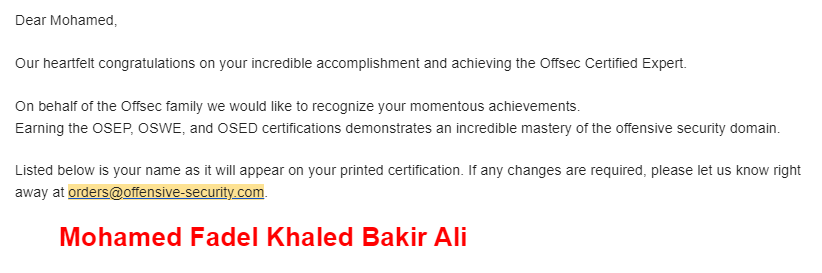

Or receive the following package:

  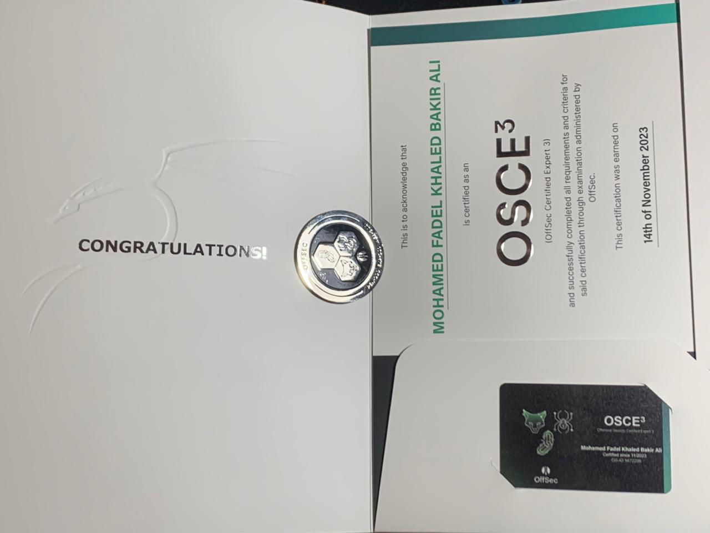

## OffSec macOS Researcher (OSMR)

  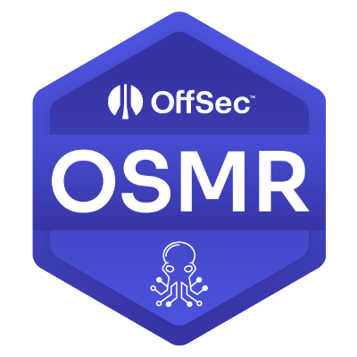

For the OSMR course, I started with no prior experience in macOS security, although I had extensive experience in iOS security. My approach involved thoroughly reading each topic, taking detailed notes, tackling the labs, and working through the extra miles.

The course is well-structured, with a focus on depth and detail, offering a comprehensive education in macOS security. Its approach is somewhat similar to OSWE, though tailored to macOS. The emphasis on reproducing CVEs provides valuable hands-on experience, making it an excellent choice for those interested in research and deepening their understanding of macOS security.

* [Exam Guide](https://help.offsec.com/hc/en-us/articles/4411107766804-EXP-312-Advanced-macOS-Control-Bypasses-OSMR-Exam-Guide)
* [Exam FAQ](https://help.offsec.com/hc/en-us/articles/4411099553172-OSMR-Exam-FAQ)

I scheduled my OSMR exam for January 17, 2024. After approximately 24 hours, I completed 100% of the exam and began preparing my report the following day, not needing the full reporting day. I found the exam to be manageable, with a well-prepared study and practice routine making it easier to handle. The experience was both enjoyable and highly rewarding, reflecting the quality of the exam.

The content of the OSMR course is extremely well-crafted and demanding, pushing you to your limits. To fully grasp the material, you should be comfortable with Objective-C, as it is crucial for understanding and engaging with the course content effectively.

Similar to my achievement with OSCE3, I was the first person in Egypt to pass the OSMR exam, which greatly motivated me to continue pursuing further advancements in the field.

I Submitted my report at early 19 Jan 2024 and received the results 24 hours later at 20 Janurary 2024.

My advice for preparing for the OSMR is as follows:

- **Thoroughly Complete the Labs**: Engage deeply with all lab exercises to fully master the material and enhance your practical skills.

- **Address All Challenges**: Ensure that you solve all challenge labs to build both confidence and expertise in your abilities.

- **Tackle Extra Miles**: Engage with additional exercises and "extra miles" provided to further deepen your understanding.

- **Proficiency in Objective-C**: Develop a strong proficiency in reading and writing Objective-C code, as well as familiarity with other languages such as C.

- **Consistent Practice**: Regularly practice and train to refine your skills.

- **Review MacOS CVEs**: Search for and review the latest CVEs to practice reproduction and stay current with vulnerabilities.

- **Invest in Reverse Engineering**: Continuously enhance your reverse engineering skills through dedicated practice.

- **Understand ARM Assembly**: Gain proficiency in ARM assembly through focused practice.

- **Build Your Own MacOS Lab**: If feasible, create your own MacOS lab environment to facilitate in-depth research, though this is not required. 

In conclusion, the OSMR course is a highly recognized program dedicated to MacOS security research. Although it focuses exclusively on MacOS, the skills and knowledge gained are highly relevant and beneficial, especially if you have a background in iOS security. The course provides valuable insights and practical experience in MacOS security, making it a highly recommended option for those interested in this field. I thoroughly enjoyed it and found it to be an excellent learning experience.

## Conclusion

In conclusion, the overall journey has been very rewarding, with its ups and downs, much like anything in life. It is important to adapt, be flexible, challenge yourself, and avoid letting others' opinions influence your perspective. Do not overestimate or underestimate the challenges you face.

Achieving these milestones is not the end; rather, it is just a step on the ladder toward further accomplishments and growth.

Do not expect immediate recognition or validation after completing these achievements, even within a short timeframe. For instance, when applying for jobs, I encountered skepticism from HR who questioned the value of my extensive efforts, leading to lost opportunities due to their lack of understanding. This experience reinforced the importance of disregarding others' opinions and focusing solely on your own happiness and goals.

Regarding certifications, such as OSDA, I chose not to pursue it despite having experience in its topics, as I wasn't interested in blue teaming in that time.

Upon completing my previous certifications, I found myself seeking further engagement and growth. Consequently, I undertook the Certified Red Team Lead (CRTL) exam. This exam proved to be both highly enjoyable and enriching.

I want to express my gratitude to everyone who has read this blog post. I hope my experiences have been valuable to you. Remember to trust in your journey, train diligently, and stay focused on your goals—regardless of external opinions.

I would also like to extend my gratitude to OffSec for providing these exceptional courses and challenging exams.

Thank You
 CPUKiller.

> There Is A Difference Between Knowing The Path And Walking The Path..